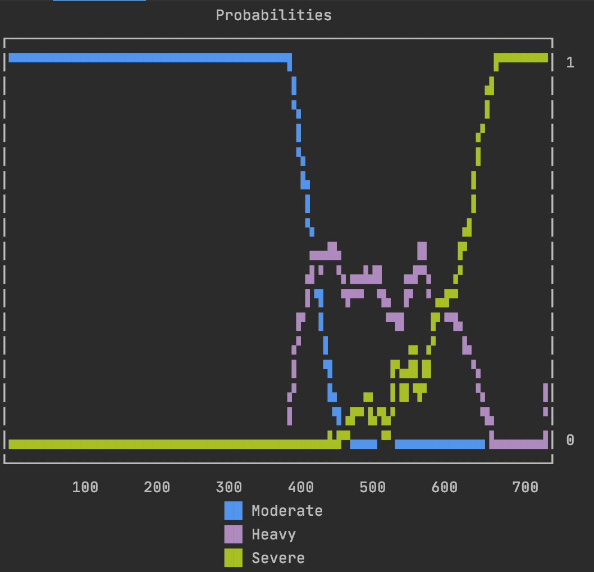

<div id="top"></div>
<!--
*** Thanks for checking out the Best-README-Template. If you have a suggestion
*** that would make this better, please fork the repo and create a pull request
*** or simply open an issue with the tag "enhancement".
*** Don't forget to give the project a star!
*** Thanks again! Now go create something AMAZING! :D
-->

<!-- PROJECT SHIELDS -->
<!--
*** I'm using markdown "reference style" links for readability.
*** Reference links are enclosed in brackets [ ] instead of parentheses ( ).
*** See the bottom of this document for the declaration of the reference variables
*** for contributors-url, forks-url, etc. This is an optional, concise syntax you may use.
*** https://www.markdownguide.org/basic-syntax/#reference-style-links
-->

[![Contributors][contributors-shield]][contributors-url]
[![Forks][forks-shield]][forks-url]
[![Stargazers][stars-shield]][stars-url]
[![Issues][issues-shield]][issues-url]
[![MIT License][license-shield]][license-url]
[![LinkedIn][linkedin-shield]][linkedin-url]


<!-- PROJECT LOGO -->
<br />
<div align="center">
  <a>
    
  </a>
  <h3 align="center">The Oxynet Python package repository</h3>
  <p align="center">
    <a> :earth_africa: </a>
    <br />
    <a> With strained healthcare systems and ageing populations, we require world-wide coordinated actions for timely diagnostics.</a>
    <br />
        <az> :hospital: </a>
    <br />
    <a> We want to contribute with sustainable approaches to more equitable health and care services.</a>
    <br />
        <a> :computer: </a>
    <br />
    <a> With Oxynet we develop automatic interpreter of cardiopulmonary exercising tests.</a>
    <br />
    <br />
    <a href="http://oxynet.net"><strong>Visit the website »</strong></a>
    <br />
    <a href="https://www.overleaf.com/read/zgsfxmvcbhkz">Overleaf</a>
    ·
    <a href="https://oxynetresearch.promfacility.eu">Web app</a>
    ·
    <a href="https://pypi.org/project/pyoxynet/">Pypi</a>
    ·
    <a href="https://pyoxynet.readthedocs.io/en/latest/index.html">Docs</a>
  </p>
</div>

<!-- ABOUT THE PROJECT -->
## The Oxynet Project

<!--[![Product Name Screen Shot][product-screenshot]](https://example.com)-->

There are challenges that transcend both national and continental boundaries and providing people with universal access to good quality health care is one of them. Emerging technologies in the field of AI and the availability of vast amounts of data can offer big opportunities to stimulate innovation and develop solutions.

Oxynet wants to become a tool for a quick and encompassing diagnosis of medical conditions with cardiopulmonary exercise tests (CPET) and promote accurate and timely clinical decisions, ultimately reducing the costs associated with current evaluation errors and delays.

The main building blocks of Oxynet are: 

* A network of experts in the field of CPET
* A large crowdsourced data set
* An AI algorithm able to approximate human cognition in the analysis of CPET 

We are interested in creating more research opportunities with other Universities and Departments, hospitals and clinics, medical doctors and physiologists (also operating in intensive care units), companies involved in the development (including patenting and validation) and in the commercialisation of medical devices (e.g. metabolic carts and medical software). 

We want to bring together key actors from across sectors to jointly implement our R&D road map and: support the research activities financially (including scholarships for research fellows or publication fees for open access journals), provide intellectual contribution for scientific publications or grant application, share data for testing/developing new algorithms, develop web-based applications (e.g. crowdsourcing applications, automatic interpretation of new data, websites for communicating the outcomes of the project), conduct market and patent analyses, and validate the algorithms for clinical settings.

<p align="right">(<a href="#top">back to top</a>)</p>

## The Pyoxynet package

Pyoxynet implements with TFLite the intelligence behind Oxynet algorithms. TFLite has been intentionally adopted to keep the package light and to promote the use of Oxynet related technologies. 

You can read more about the rationale and the techhnology behind the Oxynet project at the following links: 

* [Review](https://link.springer.com/article/10.1007%2Fs11332-019-00557-x) paper on the AI technologies applied to exercise cardiopulmonary and metabolic data processing
* [Research](https://journals.plos.org/plosone/article?id=10.1371/journal.pone.0229466) implementing an LSTM neural netwok to the estimation of VO2 during cycling exercise (regressor)
* [Research](https://www.tandfonline.com/doi/abs/10.1080/17461391.2019.1587523?journalCode=tejs20) implementing an LSTM neural netwok to the estimation of the intensity domain during incremental exercise (classifier)
* [Research](https://www.tandfonline.com/doi/abs/10.1080/17461391.2020.1866081?journalCode=tejs20) implementing a crowd sourcing and CNN inference to the problem of determining the intensity domain during incremental exercise (classifier)
* [Blog article](https://www.linkedin.com/pulse/oxynet-collective-intelligence-approach-test-andrea-zignoli/) about the Oxynet project

<p align="right">(<a href="#top">back to top</a>)</p>

<!-- GETTING STARTED -->
## Getting Started

This is an example of how you may give instructions on setting up your project locally.
To get a local copy up and running follow these simple example steps.

### Pip install the package

This is an example of how to list things you need to use the software and how to install them.

```sh
pip install pyoxynet
```

Packages that require addition extra url cannot be installed via setuptools, which letely allows and suggests to use pip when possibile. To workaround this problem, TFLite is automatically installed with the following command the first time pyoxynet is imported:

```sh
pip install --extra-index-url https://google-coral.github.io/py-repo/ tflite_runtime
```

<p align="right">(<a href="#top">back to top</a>)</p>

### Installation

_Below is an example of how you can instruct your audience on installing and setting up your app. This template doesn't rely on any external dependencies or services._

1. Get a free API Key at [https://example.com](https://example.com)
2. Clone the repo
   ```sh
   git clone https://github.com/your_username_/Project-Name.git
   ```
3. Install NPM packages
   ```sh
   npm install
   ```
4. Enter your API in `config.js`
   ```js
   const API_KEY = 'ENTER YOUR API';
   ```

<p align="right">(<a href="#top">back to top</a>)</p>

<!-- USAGE EXAMPLES -->
## Usage

Data required for the inference include oxygen uptake (VO2), exhaled CO2 (VCO2), minute ventilation (VE), end tidal O2 (PetO2) and CO2(PetCO2), and ventilatory equivalents (VEVO2 and VEVCO2):

| VO2 | VCO2 | VE | PetO2 | PetCO2 | VEVO2 | VEVCO2 |
|-----|------|----|-------|--------|-------|--------|
|     |      |    |       |        |       |        |
|     |      |    |       |        |       |        |
|     |      |    |       |        |       |        |

Oxynet inference models work on data oversampled on a sec-by-sec basis. When dealing with breath-by-breath data, linear interpolation at 1 second is appropriate. When dealing with averaged 5-by-5 second data or 10-by-10 second data, cubic interpolation is more appropriate. Pyoxynet however, can implement a number of interpolation algorithm to process raw data as well as data already processed. 

### See pyoxynet at work on sample data

```python
import pyoxynet

# Load the TFL model
tfl_model = pyoxynet.load_tf_model()

# Make inference on a random input
test_tfl_model(tfl_model)

# Plot the inference on a test dataset
pyoxynet.test_pyoxynet()
```



_For more examples, please refer to the package [Documentation](https://pyoxynet.readthedocs.io/en/latest/index.html)_

<p align="right">(<a href="#top">back to top</a>)</p>

<!-- ROADMAP -->
## Roadmap

- [x] Create web app for inference
- [x] Create web app for data crowd sourcing
- [x] Create website
- [ ] Create Python package for inference
- [ ] ----
- [ ] ----
    - [ ] ----
    - [ ] ----

See the [open issues](https://github.com/andreazignoli/pyoxynet/issues) for a full list of proposed features (and known issues).

<p align="right">(<a href="#top">back to top</a>)</p>

<!-- CONTRIBUTING -->
## Contributing

Contributions are what make the open source community such an amazing place to learn, inspire, and create. Any contributions you make are **greatly appreciated**.

If you have a suggestion that would make this better, please fork the repo and create a pull request. You can also simply open an issue with the tag "enhancement".
Don't forget to give the project a star! Thanks again!

1. Fork the Project
2. Create your Feature Branch (`git checkout -b feature/AmazingFeature`)
3. Commit your Changes (`git commit -m 'Add some AmazingFeature'`)
4. Push to the Branch (`git push origin feature/AmazingFeature`)
5. Open a Pull Request

<p align="right">(<a href="#top">back to top</a>)</p>

<!-- LICENSE -->
## License

Distributed under the MIT License. See `LICENSE.txt` for more information.

<p align="right">(<a href="#top">back to top</a>)</p>

<!-- CONTACT -->
## Contact

Andrea Zignoli - [@andrea_zignoli](https://twitter.com/andrea_zignoli) - andrea.zignoli@unitn.it

Repository project link: [pyoxynet](https://github.com/andreazignoli/pyoxynet)

<p align="right">(<a href="#top">back to top</a>)</p>

<!-- ACKNOWLEDGMENTS -->
## Acknowledgments

The following resources are extremely valuable for both the pyoxynet and Oxynet projects:

* [TFLite inference](https://www.tensorflow.org/lite/guide/inference)
* [Uniplot Python library](https://github.com/olavolav/uniplot)

<p align="right">(<a href="#top">back to top</a>)</p>

<!-- MARKDOWN LINKS & IMAGES -->
<!-- https://www.markdownguide.org/basic-syntax/#reference-style-links -->
[contributors-shield]: https://img.shields.io/github/contributors/andreazignoli/pyoxynet.svg?style=for-the-badge
[contributors-url]: https://github.com/andreazignoli/pyoxynet/graphs/contributors
[forks-shield]: https://img.shields.io/github/forks/andreazignoli/pyoxynet.svg?style=for-the-badge
[forks-url]: https://github.com/andreazignoli/pyoxynet/network/members
[stars-shield]: https://img.shields.io/github/stars/andreazignoli/pyoxynet.svg?style=for-the-badge
[stars-url]: https://github.com/andreazignoli/pyoxynet/stargazers
[issues-shield]: https://img.shields.io/github/issues/andreazignoli/pyoxynet.svg?style=for-the-badge
[issues-url]: https://github.com/andreazignoli/pyoxynet/issues
[license-shield]: https://img.shields.io/github/license/andreazignoli/pyoxynet.svg?style=for-the-badge
[license-url]: https://github.com/andreazignoli/pyoxynet/blob/master/LICENSE.txt
[linkedin-shield]: https://img.shields.io/badge/-LinkedIn-black.svg?style=for-the-badge&logo=linkedin&colorB=555
[linkedin-url]: https://www.linkedin.com/in/andrea-zignoli-8080a438/
[product-screenshot]: images/screenshot.png

# Disclaimer

All content found on this website, including: text, images, tables, or other formats are created for informational purposes only. The information provided by this software is not intended to be a substitute for professional medical advice, diagnosis, or treatment. Always seek the advice of your physician or other qualified health provider with any questions you may have regarding a medical condition. Never disregard professional medical advice or delay in seeking it because of something has been provided by this software.