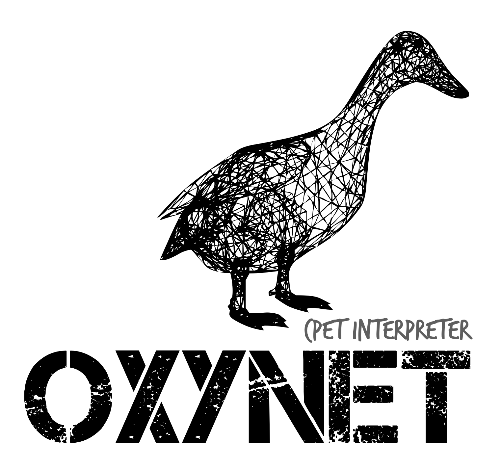

<div id="top"></div>
<!--
*** Thanks for checking out the Best-README-Template. If you have a suggestion
*** that would make this better, please fork the repo and create a pull request
*** or simply open an issue with the tag "enhancement".
*** Don't forget to give the project a star!
*** Thanks again! Now go create something AMAZING! :D
-->

<!-- PROJECT SHIELDS -->
<!--
*** I'm using markdown "reference style" links for readability.
*** Reference links are enclosed in brackets [ ] instead of parentheses ( ).
*** See the bottom of this document for the declaration of the reference variables
*** for contributors-url, forks-url, etc. This is an optional, concise syntax you may use.
*** https://www.markdownguide.org/basic-syntax/#reference-style-links
-->

[![Contributors][contributors-shield]][contributors-url]
[![Forks][forks-shield]][forks-url]
[![Stargazers][stars-shield]][stars-url]
[![Issues][issues-shield]][issues-url]
[![MIT License][license-shield]][license-url]
[![LinkedIn][linkedin-shield]][linkedin-url]


<!-- PROJECT LOGO -->
<br />
<div align="center">
  <a href="https://github.com/othneildrew/Best-README-Template">
    
  </a>

  <h3 align="center">The Oxynet Python package repository</h3>

  <p align="center">
    <a> :earth_africa: </a>
    <br />
    <a> With strained healthcare systems and ageing populations, we require world-wide coordinated actions for timely diagnostics.</a>
    <br />
        <aZ> :hospital: </a>
    <br />
    <a> We want to contribute with sustainable approaches to more equitable health and care services.</a>
    <br />
        <a> :computer: </a>
    <br />
    <a> With Oxynet we develop automatic interpreter of cardiopulmonary exercising tests.</a>
    <br />
    <br />
    <a href="http://oxynet.net"><strong>Visit the website »</strong></a>
    <br />
    <a href="https://www.overleaf.com/read/zgsfxmvcbhkz">Overleaf</a>
    ·
    <a href="https://oxynetresearch.promfacility.eu">Web app</a>
    ·
    <a href="https://pypi.org/project/pyoxynet/">Pypi</a>
    ·
    <a href="https://pyoxynet.readthedocs.io/en/latest/index.html">Docs</a>
  </p>
</div>

<!-- ABOUT THE PROJECT -->
## The Oxynet Project

<!--[![Product Name Screen Shot][product-screenshot]](https://example.com)-->

There are challenges that transcend both national and continental boundaries and providing people with universal access to good quality health care is one of them. Emerging technologies in the field of AI and the availability of vast amounts of data can offer big opportunities to stimulate innovation and develop solutions.

Oxynet wants to become a tool for a quick and encompassing diagnosis of medical conditions with cardiopulmonary exercise tests (CPET) and promote accurate and timely clinical decisions, ultimately reducing the costs associated with current evaluation errors and delays.

The main building blocks of Oxynet are: 

* A network of experts in the field of CPET
* A large crowdsourced data set
* An AI algorithm able to approximate human cognition in the analysis of CPET 

The people and the institutions currently involved in this project are listed in Sect. \ref{contributors} of this document. Nevertheless, we are interested in creating more research opportunities with other Universities and Departments, hospitals and clinics, medical doctors and physiologists (also operating in intensive care units), companies involved in the development (including patenting and validation) and in the commercialisation of medical devices (e.g. metabolic carts and medical software). 

We want to bring together key actors from across sectors to jointly implement our R&D road map and: support the research activities financially (including scholarships for research fellows or publication fees for open access journals), provide intellectual contribution for scientific publications or grant application, share data for testing/developing new algorithms, develop web-based applications (e.g. crowdsourcing applications, automatic interpretation of new data, websites for communicating the outcomes of the project), conduct market and patent analyses, and validate the algorithms for clinical settings.

<p align="right">(<a href="#top">back to top</a>)</p>

<!-- GETTING STARTED -->
## Getting Started

This is an example of how you may give instructions on setting up your project locally.
To get a local copy up and running follow these simple example steps.

### Pip install the package

This is an example of how to list things you need to use the software and how to install them.

```sh
pip install pyoxynet
```

<p align="right">(<a href="#top">back to top</a>)</p>

### Installation

_Below is an example of how you can instruct your audience on installing and setting up your app. This template doesn't rely on any external dependencies or services._

1. Get a free API Key at [https://example.com](https://example.com)
2. Clone the repo
   ```sh
   git clone https://github.com/your_username_/Project-Name.git
   ```
3. Install NPM packages
   ```sh
   npm install
   ```
4. Enter your API in `config.js`
   ```js
   const API_KEY = 'ENTER YOUR API';
   ```

<p align="right">(<a href="#top">back to top</a>)</p>

<!-- USAGE EXAMPLES -->
## Usage

Use this space to show useful examples of how a project can be used. Additional screenshots, code examples and demos work well in this space. You may also link to more resources.

_For more examples, please refer to the [Documentation](https://example.com)_

<p align="right">(<a href="#top">back to top</a>)</p>

<!-- ROADMAP -->
## Roadmap

- [x] Add Changelog
- [x] Add back to top links
- [ ] Add Additional Templates w/ Examples
- [ ] Add "components" document to easily copy & paste sections of the readme
- [ ] Multi-language Support
    - [ ] Chinese
    - [ ] Spanish

See the [open issues](https://github.com/othneildrew/Best-README-Template/issues) for a full list of proposed features (and known issues).

<p align="right">(<a href="#top">back to top</a>)</p>

<!-- CONTRIBUTING -->
## Contributing

Contributions are what make the open source community such an amazing place to learn, inspire, and create. Any contributions you make are **greatly appreciated**.

If you have a suggestion that would make this better, please fork the repo and create a pull request. You can also simply open an issue with the tag "enhancement".
Don't forget to give the project a star! Thanks again!

1. Fork the Project
2. Create your Feature Branch (`git checkout -b feature/AmazingFeature`)
3. Commit your Changes (`git commit -m 'Add some AmazingFeature'`)
4. Push to the Branch (`git push origin feature/AmazingFeature`)
5. Open a Pull Request

<p align="right">(<a href="#top">back to top</a>)</p>

<!-- LICENSE -->
## License

Distributed under the MIT License. See `LICENSE.txt` for more information.

<p align="right">(<a href="#top">back to top</a>)</p>

<!-- CONTACT -->
## Contact

Andrea Zignoli - [@andrea_zignoli](https://twitter.com/andrea_zignoli) - andrea.zignoli@unitn.it

Repository project link: [pyoxynet](https://github.com/andreazignoli/pyoxynet)

<p align="right">(<a href="#top">back to top</a>)</p>

<!-- ACKNOWLEDGMENTS -->
## Acknowledgments

Use this space to list resources you find helpful and would like to give credit to. I've included a few of my favorites to kick things off!

* [Choose an Open Source License](https://choosealicense.com)
* [GitHub Emoji Cheat Sheet](https://www.webpagefx.com/tools/emoji-cheat-sheet)
* [Malven's Flexbox Cheatsheet](https://flexbox.malven.co/)
* [Malven's Grid Cheatsheet](https://grid.malven.co/)
* [Img Shields](https://shields.io)
* [GitHub Pages](https://pages.github.com)
* [Font Awesome](https://fontawesome.com)
* [React Icons](https://react-icons.github.io/react-icons/search)

<p align="right">(<a href="#top">back to top</a>)</p>

<!-- MARKDOWN LINKS & IMAGES -->
<!-- https://www.markdownguide.org/basic-syntax/#reference-style-links -->
[contributors-shield]: https://img.shields.io/github/contributors/andreazignoli/pyoxynet.svg?style=for-the-badge
[contributors-url]: https://github.com/andreazignoli/pyoxynet/graphs/contributors
[forks-shield]: https://img.shields.io/github/forks/andreazignoli/pyoxynet.svg?style=for-the-badge
[forks-url]: https://github.com/andreazignoli/pyoxynet/network/members
[stars-shield]: https://img.shields.io/github/stars/andreazignoli/pyoxynet.svg?style=for-the-badge
[stars-url]: https://github.com/andreazignoli/pyoxynet/stargazers
[issues-shield]: https://img.shields.io/github/issues/andreazignoli/pyoxynet.svg?style=for-the-badge
[issues-url]: https://github.com/andreazignoli/pyoxynet/issues
[license-shield]: https://img.shields.io/github/license/andreazignoli/pyoxynet.svg?style=for-the-badge
[license-url]: https://github.com/andreazignoli/pyoxynet/blob/master/LICENSE.txt
[linkedin-shield]: https://img.shields.io/badge/-LinkedIn-black.svg?style=for-the-badge&logo=linkedin&colorB=555
[linkedin-url]: https://www.linkedin.com/in/andrea-zignoli-8080a438/
[product-screenshot]: images/screenshot.png